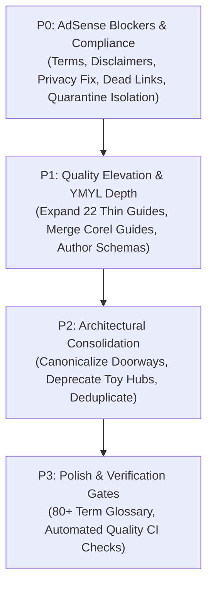

# Navorika AdSense Low-Value Content Remediation Audit

**Target Site:** navorika.com  
**Repository:** js91872/navorika (`/home/jaspal/navorika`)  
**AdSense Review Status:** *"Needs attention – Low-value content"*  
**Audit Date:** September 27, 2026  
**Status:** Audit & Remediation Plan Complete — No Code / Content Modified  

---

## 1. Executive Summary

Google AdSense has reviewed `navorika.com` and returned a rejection status of **"Needs attention – Low-value content."**

In Google's publisher quality guidelines, "Low-value content" does **not** mean the site lacks code or visitors. Rather, it indicates that Google's automated review systems and human Quality Raters (QRGs) detected structural, editorial, and architectural signals that correlate with doorway pages, thin syndication, near-duplicate utilities, or missing publisher accountability.

### Root Cause Analysis

A thorough site-wide audit of all **388 known routes** (including **369 indexable sitemap URLs**) revealed that while Navorika possesses dozens of genuinely high-utility, well-engineered calculators and file tools, the site is burdened by several critical quality blockers:

1. **Doorway & Near-Duplicate Tool Sprawl (43 URLs):**
   - Multiple clusters of tools share 95%+ identical source code with minor hardcoded parameter variations (e.g., `/tools/compress-image-to-20kb`, `to-50kb`, `to-100kb`, `to-200kb`, `compress-jpg-to-100kb`, `compress-png-to-100kb`). In Google's Search Essentials, generating dedicated URLs for arbitrary target thresholds without unique supporting methodology is categorized as doorway pages.
   - Dual-registered routes for the same underlying utility (e.g., `/tools/yaml-json-converter` alongside `/tools/yaml-to-json-converter` and `/tools/json-to-yaml-converter`; `/tools/unix-timestamp-converter` alongside `/tools/epoch-time-converter`; `/tools/uuid-generator` alongside `/tools/uuid-generator-validator`).
   - Finance suite sub-routes competing with standalone tools (e.g., `/tools/loan-amortization-suite/emi-calculator` competing with `/tools/loan-emi-calculator`).

2. **Generic Legacy Hubs with Template Filler & Broken Links:**
   - `/tools/developer-utils`: A legacy 3-tab widget (Regex, Epoch, Gradient) containing boilerplate filler copy (*"Process your documents efficiently with this tool"* on an epoch timestamp converter).
   - `/tools/webmaster-seo-builder`: A registered "tool" route that contains no tool interface at all, merely rendering 3 links to other tools.
   - `/hubs/finance`: A thin landing page containing 5 guide links, **4 of which lead to 404 Not Found pages** due to broken slug references (`understanding-emi-calculations`, `gst-compliance-guide`, `ppf-vs-fd-where-to-invest`, `income-tax-planning-tips`).

3. **Critical Site-Level Legal & Trust Deficits:**
   - **Missing Terms of Service (`/terms`):** The site has no Terms of Service page. AdSense policy raters expect clear user agreements on sites handling file conversions and calculations.
   - **Missing Legal & Calculation Disclaimers (`/disclaimer`):** The site offers high-stakes YMYL (Your Money or Your Life) calculators—such as income tax calculation, home loan EMI amortization, body mass index, cardiac heart rate zones, and structural joist deflection—with no formal liability or informational disclaimer.
   - **Missing Editorial & Methodology Standards (`/methodology`):** Zero explanation of who creates, tests, or verifies mathematical calculations, architectural standards, or conversion logic.
   - **Direct Privacy Policy Contradiction:** `/privacy` explicitly claims under its cookie policy: *"No third-party advertising"*. Applying for Google AdSense (a third-party advertising network) with a privacy policy stating that no third-party advertising exists is an automatic policy violation.
   - **Defective Contact Page (`/contact`):** Displays a placeholder location (*"Navorika / Digital Products"*) and renders an interactive `<form>` that has no submission handler, API endpoint, or action attribute—clicking "Send Message" fails silently.
   - **Defective About Page (`/about`):** Contains exclusively generic marketing rhetoric (*"Built for 2030 and beyond"*, *"Join thousands of users"*), with zero named team members, zero corporate entity disclosures, and zero physical location.

4. **Thin & Superficial Content on High-Stakes YMYL Guides (14 Guides <400 Words):**
   - Articles such as `/guides/tax-planning-guide-2026` (323 words) and `/guides/macronutrients-guide` (321 words) are advertised in page metadata as *"10 min read"* and *"7 min read"* comprehensive guides, but contain only 3–4 generic paragraphs and anonymous publisher schema (`"author": { "@type": "Organization", "name": "Navorika" }`). Quality raters flag this immediately as low-effort content.

5. **Exposed Quarantined & Placeholder Routes:**
   - 6 tools placed under review (`blur-face`, `bioluminescent-reader`, `image-dpi-converter`, `png-to-svg`, `protect-pdf`, `unlock-pdf`) still resolve with HTTP 200 and display messages stating: *"The previous route altered arbitrary pixels and did not detect or blur faces"* or *"The previous route accepted files but performed no scientific parsing"*.
   - Furthermore, internal links in `src/data/taxonomy.ts` and `src/lib/guideTools.ts` continue pointing users and crawlers to these quarantined pages.
   - In `src/lib/toolDescriptions.ts`, working tools such as `code-minifier-beautifier` and `markup-formatter` are still described on the `/tools` index as *"Temporarily unavailable pending parser-backed code processing"*.

### Strategic Approach

Remediation does **not** involve stuffing articles with AI boilerplate or artificially inflating word counts. The plan establishes genuine first-party value:
- **Protect Strong Assets (122 routes):** High-utility calculations, deep guides, and complex vector/PDF processors remain untouched.
- **P0 Immediate Remediation:** Build missing compliance pages (`/terms`, `/disclaimer`, `/methodology`), fix the `/privacy` advertising contradiction, fix the `/contact` form, sever links to quarantined routes, and fix broken hub links.
- **P1 Quality Consolidation:** Merge overlapping CorelDRAW guides, expand the thin YMYL guides with authoritative tax/medical data and author credentials, and canonicalize duplicate doorway tools.

---

## 2. Total Indexable Routes & Census Breakdown

The repository currently defines **388 total known routes**, of which **369 are indexable URLs submitted via sitemap.xml**.

### Sitemap Route Inventory (369 Indexable URLs)

| Route Type | Count | Description / URLs |
|---|:---:|---|
| **Static Core Routes** | **10** | `/`, `/tools`, `/categories`, `/toolkits`, `/guides`, `/about`, `/contact`, `/glossary`, `/privacy`, `/hubs/finance` |
| **Tool Pages (Standard)** | **283** | Standalone tool routes under `/tools/[slug]` |
| **Finance Suite Sub-Routes** | **19** | Dynamic sub-routes under `/tools/[suite]/[suboption]` |
| **Category Pages** | **7** | `/categories/[slug]` (PDF, Image, Finance, Health, Developer, Construction, Everyday) |
| **Toolkit Pages** | **8** | `/toolkits/[slug]` (curated workflow hub suites) |
| **Guides** | **42** | Editorial guide routes under `/guides/[slug]` |
| **Total Indexable Sitemap URLs** | **369** | Total verified in `src/app/sitemap.ts` |

### Non-Sitemap Known Routes (19 URLs)

| Route Type | Count | Slugs / Paths | Status |
|---|:---:|---|---|
| **Quarantined Tools Under Review** | **6** | `blur-face`, `bioluminescent-reader`, `image-dpi-converter`, `png-to-svg`, `protect-pdf`, `unlock-pdf` | HTTP 200, `noindex`, displays "Temporarily unavailable" |
| **Finance Suite Root Redirects** | **6** | `/tools/cashflow-budget-architect`, `investment-return-profiler`, `loan-amortization-suite`, `savings-retirement-hub`, `taxation-compliance-deck`, `wealth-inflation-matrix` | HTTP 308 permanent redirects to default suboptions |
| **Excluded Finance Suite Sub-Routes** | **5** | `/tools/taxation-compliance-deck/[income-tax-calculator, gst-calculator, hra-calculator]`, `/tools/savings-retirement-hub/[fd-calculator, ppf-calculator]` | Excluded from sitemap to prevent collision with standalone tools |
| **Static HTML Sitemap** | **1** | `/sitemap` | User-facing HTML sitemap (mirrors XML) |
| **Internal / Blocked Endpoints** | **1** | `/tools.json` (also `/api/`, `/debug`, `/search` disallowed in robots.ts) | API / Developer metadata endpoints |
| **Total Known System Routes** | **388** | 369 in sitemap + 19 non-sitemap routes | |

---

## 3. Route Classification by Quality Group (A–F)

Every known route in Navorika has been audited and classified into one of six distinct quality tiers:

| Quality Tier | Total Known | Sitemap URLs | Definition & Quality Implication |
|---|:---:|:---:|---|
| **Group A — STRONG** | **122** | **121** | Genuinely useful functionality, substantial original content, robust math/code engines. Leave untouched. |
| **Group B — IMPROVE** | **179** | **179** | Functioning, useful tools whose documentation, formulas, limitations, FAQs, or linking need enrichment. |
| **Group C — DUPLICATIVE** | **43** | **43** | Functionality substantially overlaps another page (preset variations, doorway pages, one-way/two-way clones). |
| **Group D — WEAK / THIN** | **22** | **22** | Pages providing little utility, broken links, thin glossary entries, or guides with <400 words. |
| **Group E — NONFUNCTIONAL** | **6** | **0** | Quarantined placeholder routes returning "Temporarily unavailable" or admitting non-functioning past code. |
| **Group F — INDEXING QUESTIONABLE** | **16** | **4** | Directory pages, redirect roots, and duplicate sub-routes that do not warrant independent indexing. |
| **Total Route Census** | **388** | **369** | Full site route coverage accounted for. |

---

## 4. Full Breakdown of Each Quality Group

### Group A — STRONG (122 Routes: 121 in Sitemap + Homepage)
*Pages with genuinely useful functionality and substantial unique supporting content. These pages are high-value assets and must be preserved without regression.*

- **Flagship Sandboxed & Client-Side Processors (18 tools):**  
  `/tools/html-to-image`, `/tools/web-crypto-studio`, `/tools/jwt-decoder`, `/tools/json-schema-validator`, `/tools/typescript-to-zod-schema-converter`, `/tools/json-diff-compare`, `/tools/json-to-csv-flattener`, `/tools/cron-expression-generator`, `/tools/cron-expression-humanizer`, `/tools/cron-next-run-calculator`, `/tools/docker-run-command-generator`, `/tools/vlsm-subnet-calculator`, `/tools/cidr-subnet-wildcard-calculator`, `/tools/cidr-summarization-calculator`, `/tools/ipv6-subnet-calculator`, `/tools/ulid-generator`, `/tools/binary-to-decimal-with-steps`, `/tools/utf8-vs-utf16-byte-calculator`.
- **Advanced Construction & Structural Engineering Calculators (12 tools):**  
  `/tools/roof-pitch-calculator`, `/tools/stair-stringer-calculator`, `/tools/12-foot-gambrel-roof-truss-calculator`, `/tools/joist-deflection-calculator`, `/tools/hvac-duct-cfm-calculator`, `/tools/wire-size-calculator`, `/tools/voltage-drop-calculator`, `/tools/egress-window-code-checker`, `/tools/concrete-calculator`, `/tools/rebar-calculator`, `/tools/step-to-3d-pdf-converter`, `/tools/construction-estimate-builder`.
- **High-Value SaaS, Real Estate & Business Financial Calculators (25 tools):**  
  `/tools/cap-rate-calculator`, `/tools/cash-on-cash-return-calculator`, `/tools/rental-property-cash-flow-calculator`, `/tools/brrrr-calculator`, `/tools/fix-and-flip-profit-calculator`, `/tools/saas-burn-rate-calculator`, `/tools/startup-runway-calculator`, `/tools/cac-payback-calculator`, `/tools/net-revenue-retention-calculator`, `/tools/rule-of-40-calculator`, `/tools/llm-api-cost-calculator`, `/tools/gpu-compute-cost-calculator`, `/tools/cloud-hosting-cost-calculator`, `/tools/cdn-cost-calculator`, `/tools/ai-token-calculator`, `/tools/break-even-calculator`, `/tools/profit-margin-markup-calculator`, `/tools/lumpsum-investment-calculator`, `/tools/savings-goal-calculator`, `/tools/mortgage-affordability-calculator`, `/tools/sip-calculator`, `/tools/loan-emi-calculator`, `/tools/tax-calculator`, `/tools/salary-calculator`, `/tools/currency-converter`.
- **Core Document & PDF Processing Suite (20 tools):**  
  `/tools/merge-pdf`, `/tools/split-pdf`, `/tools/compress-pdf`, `/tools/rotate-pdf`, `/tools/reorder-pdf`, `/tools/delete-pdf-pages`, `/tools/extract-pdf-pages`, `/tools/extract-pdf-text`, `/tools/add-page-numbers`, `/tools/add-watermark`, `/tools/sign-pdf`, `/tools/flatten-pdf`, `/tools/crop-pdf`, `/tools/interleave-pdf`, `/tools/pdf-metadata-editor`, `/tools/pdf-page-size-checker`, `/tools/pdf-bleed-trim-checker`, `/tools/pdf-word-counter`, `/tools/pdf-to-image`, `/tools/image-to-pdf`.
- **Core Image Utilities (20 tools):**  
  `/tools/compress-image`, `/tools/compress-jpg`, `/tools/compress-png`, `/tools/compress-webp`, `/tools/resize-image`, `/tools/crop-image`, `/tools/rotate-image`, `/tools/photo-editor`, `/tools/photo-collage-maker`, `/tools/watermark-image`, `/tools/change-image-resolution`, `/tools/id-photo-maker`, `/tools/image-color-picker`, `/tools/meme-generator`, `/tools/image-metadata-viewer`, `/tools/upscale-image`, `/tools/batch-image-converter`, `/tools/svg-to-png`, `/tools/heic-to-jpg`, `/tools/heic-to-png`.
- **Core Developer Converters (14 tools):**  
  `/tools/json-formatter`, `/tools/base64-encoder`, `/tools/csv-to-json-converter`, `/tools/code-minifier-beautifier`, `/tools/markup-formatter`, `/tools/yaml-json-converter`, `/tools/xml-to-word-converter`, `/tools/word-to-xml-converter`, `/tools/json-to-toml-converter`, `/tools/toml-to-json-converter`, `/tools/unix-timestamp-converter`, `/tools/uuid-generator`, `/tools/qr-code-generator`, `/tools/psd-to-html`.
- **Deep Technical Guides (>650 words with verified domain accuracy) (10 guides):**  
  `/guides/open-cdr-without-coreldraw` (1,680w), `/guides/psd-to-html-conversion-guide` (1,337w), `/guides/psd-to-html-email` (1,155w), `/guides/psd-to-responsive-html` (1,047w), `/guides/how-to-calculate-sip-returns` (734w), `/guides/how-to-calculate-emi` (776w), `/guides/base64-encoding-guide` (707w), `/guides/jwt-decoding-guide` (690w), `/guides/house-construction-cost-guide` (694w), `/guides/water-tank-size-capacity-guide` (654w).
- **Core Site Navigation Roots (3 routes):**  
  `/`, `/tools`, `/guides`.

---

### Group B — IMPROVE (179 Routes)
*Functioning, useful tools and pages whose supporting explanatory content, formulas, examples, limitations, or internal links need enhancement to withstand AdSense manual quality review.*

- **Construction & Takeoff Calculators (28 tools):**  
  `deck-board-calculator`, `drywall-calculator`, `mulch-calculator`, `paver-calculator`, `topsoil-calculator`, `fence-calculator`, `paint-calculator`, `cement-calculator`, `sand-calculator`, `tile-calculator`, `steel-weight-calculator`, `brick-calculator`, `water-tank-calculator`, `roof-area-calculator`, `flooring-calculator`, `excavation-calculator`, `dumpster-weight-calculator`, `saw-kerf-calculator`, `board-foot-calculator`, `ladder-safe-reach-calculator`, `post-hole-concrete-calculator`, `rainwater-harvesting-calculator`, `concrete-block-calculator`, `construction-material-waste-calculator`, `soffit-fascia-calculator`, `attic-insulation-payback-calculator`, `shed-ramp-angle-calculator`, `mortar-calculator`.
- **Health & Athletic Biometrics Calculators (18 tools):**  
  `bmr-calculator`, `tdee-calculator`, `body-fat-calculator`, `ideal-weight-calculator`, `healthy-weight-calculator`, `calorie-calculator`, `calories-burned-calculator`, `running-calories-calculator`, `walking-calories-calculator`, `heart-rate-calculator`, `waist-to-height-ratio-calculator`, `waist-to-hip-ratio-calculator`, `lean-body-mass-calculator`, `one-rep-max-calculator`, `running-pace-calculator`, `hydration-calculator`, `wilks-dots-powerlifting-calculator`, `barbell-plate-calculator`.
- **Pet & Veterinary Calculators (3 tools):**  
  `dog-age-breed-specific-calculator`, `puppy-growth-predictor`, `cat-calorie-calculator`.
- **Health Biometrics & Lifestyle (2 tools):**  
  `caffeine-half-life-calculator`, `hrv-baseline-deviation-calculator`.
- **Energy, Automotive & Everyday Planning (8 tools):**  
  `electricity-cost-calculator`, `unit-price-calculator`, `fuel-cost-split-calculator`, `tire-size-calculator`, `heat-pump-vs-furnace-cost-calculator`, `ev-vs-gas-break-even-calculator`, `schengen-90-180-day-calculator`, `meeting-roi-calculator`.
- **Networking & Systems Administration Utilities (7 tools):**  
  `ip-address-classifier`, `ip-range-calculator`, `tcp-udp-port-range-calculator`, `common-port-service-lookup`, `http-status-code-lookup`, `mac-address-generator`, `url-parser`.
- **Developer & Design Utilities (14 tools):**  
  `css-flexbox-generator`, `css-gradient-generator`, `meta-tag-generator`, `robots-txt-generator`, `utm-builder`, `regex-tester`, `gitignore-generator`, `html-entity-encoder-decoder`, `aspect-ratio-padding-calculator`, `responsive-srcset-generator`, `svg-dimensions-checker`, `rgb-cmyk-image-checker`, `print-bleed-calculator`, `image-scaling-calculator`.
- **Image Metrics & Storage Calculators (7 tools):**  
  `image-megapixel-calculator`, `image-print-size-calculator`, `image-file-size-estimator`, `photo-storage-calculator`, `image-bandwidth-calculator`, `icon-sticker-maker`, `social-media-resizer`.
- **Business, Real Estate & Financial Planning (11 tools):**  
  `drawdown-recovery-calculator`, `job-offer-total-comp-calculator`, `short-term-rental-break-even-calculator`, `house-hacking-effective-rent-calculator`, `rental-yield-calculator`, `aws-glacier-retrieval-calculator`, `churn-impact-calculator`, `fd-calculator`, `ppf-calculator`, `gst-calculator`, `retirement-calculator`.
- **Audio & Media Metrics (2 tools):**  
  `audio-bitrate-calculator`, `audio-video-tools`.
- **CorelDRAW Client Viewer & Verification (2 tools):**  
  `cdr-viewer`, `cdr-print-readiness-checker`.
- **Specialized Data & Cryptography (2 tools):**  
  `cdr-version-converter`, `merge-xml-files`.
- **Finance Suite Sub-Routes (18 URLs in sitemap):**  
  `/tools/cashflow-budget-architect/[budget-planner, emergency-fund-calculator, credit-card-payoff]`,  
  `/tools/investment-return-profiler/[cagr-calculator, roi-calculator, swp-calculator, stock-average-calculator]`,  
  `/tools/loan-amortization-suite/[home-loan-emi, car-loan-emi, personal-loan-emi, prepayment-calculator]`,  
  `/tools/savings-retirement-hub/[epf-calculator, nps-calculator, gratuity-calculator]`,  
  `/tools/wealth-inflation-matrix/[compound-interest-calculator, inflation-calculator, net-worth-calculator, salary-calculator]`.
- **Medium-Length Guides (400–650 words) Requiring Enrichment (18 guides):**  
  `heart-rate-zones-guide`, `json-formatting-guide`, `how-to-calculate-roof-area`, `flooring-calculation-guide`, `asphalt-calculation-guide`, `gravel-calculation-guide`, `electricity-cost-calculation-guide`, `brick-calculation-guide`, `dimensional-weight-guide`, `construction-estimate-quote-guide`, `bmi-calculator-guide`, `bmr-tdee-guide`, `git-commit-message-formatter`, `yaml-validator`, and related technical overviews.
- **Taxonomy Landing Suites (15 routes):**  
  7 Category pages (`/categories/[slug]`) and 8 Toolkit pages (`/toolkits/[slug]`).
- **Site Compliance Trust Page (1 route):**  
  `/privacy` (requires immediate removal of "No third-party advertising" clause and addition of AdSense cookie disclosures).

---

### Group C — DUPLICATIVE / NEAR-DUPLICATIVE (43 Routes)
*Pages whose functionality or search intent substantially overlaps another page, creating doorway page risks, internal keyword cannibalization, or thin preset variations.*

1. **Target Image Compression Doorway Cluster (6 URLs):**  
   `/tools/compress-image-to-20kb`, `/tools/compress-image-to-50kb`, `/tools/compress-image-to-100kb`, `/tools/compress-image-to-200kb`, `/tools/compress-jpg-to-100kb`, `/tools/compress-png-to-100kb`.  
   *Risk:* All 6 share the identical `TargetCompressionTool.tsx` component with minor numeric default changes. They represent classic doorway pages.
2. **Individual Image Format Converters Overlapping General Converter (6 URLs):**  
   `/tools/convert-jpg-to-png`, `/tools/convert-png-to-jpg`, `/tools/convert-jpg-to-webp`, `/tools/convert-png-to-webp`, `/tools/convert-webp-to-jpg`, `/tools/webp-to-png`.  
   *Risk:* All share `ImageFormatConverterTool.tsx`.
3. **HTML-to-Image Preset Variants (2 URLs):**  
   `/tools/html-to-jpg-converter`, `/tools/html-to-png-converter`.  
   *Risk:* Closely tied to `/tools/html-to-image`, sharing the exact same sandboxed engine.
4. **PDF Conversion Twins (3 URLs):**  
   `/tools/pdf-to-jpg` (duplicates `pdf-to-image`), `/tools/jpg-to-pdf` (duplicates `image-to-pdf`), `/tools/webp-to-pdf` (duplicates `image-to-pdf`).
5. **Developer Two-Way / One-Way Clones (4 URLs):**  
   `/tools/yaml-to-json-converter` (duplicates `yaml-json-converter`), `/tools/json-to-yaml-converter` (duplicates `yaml-json-converter`), `/tools/epoch-time-converter` (duplicates `unix-timestamp-converter`), `/tools/uuid-generator-validator` (duplicates `uuid-generator`).
6. **Media Converter Single-Preset Clones (8 URLs):**  
   `/tools/video-to-audio-converter`, `/tools/extract-audio-from-video`, `/tools/mp4-to-mp3-converter`, `/tools/mov-to-mp3-converter`, `/tools/webm-to-mp3-converter`, `/tools/m4a-to-mp3-converter`, `/tools/wav-to-mp3-converter`, `/tools/mp3-to-wav-converter`.  
   *Risk:* All 8 wrap `MediaConverterTool.tsx` with identical underlying FFmpeg / Web Audio logic.
7. **CorelDRAW Open Interchange Exporters (11 URLs):**  
   `/tools/cdr-to-pdf-converter`, `/tools/cdr-to-png-converter`, `/tools/cdr-to-jpg-converter`, `/tools/cdr-to-svg-converter`, `/tools/cdr-to-eps-converter`, `/tools/pdf-to-cdr-converter`, `/tools/word-to-cdr-converter`, `/tools/png-to-cdr-converter`, `/tools/jpg-to-cdr-converter`, `/tools/svg-to-cdr-converter`, `/tools/ai-to-cdr-converter`.  
   *Risk:* None can write native CDR files; all explain that they download open interchange formats.
8. **Finance Suite Cannibalization (1 URL):**  
   `/tools/loan-amortization-suite/emi-calculator` (competes directly with `/tools/loan-emi-calculator`).
9. **Construction Takeoff Redundancies (2 URLs):**  
   `/tools/contractor-estimate-generator` (duplicates `construction-estimate-builder`), `/tools/polymeric-sand-calculator` (duplicates `sand-calculator`).

---

### Group D — WEAK / THIN (22 Routes)
*Pages that provide negligible utility, lack substantial unique content, contain broken links, or fail Google's minimum content requirements for AdSense monetization.*

1. **Legacy Multi-Tool Toy Hub:** `/tools/developer-utils` (3-tab widget with regex, epoch, gradient; generic document filler copy).
2. **Empty Hub Route:** `/tools/webmaster-seo-builder` (No tool functionality, just 3 links to other tools).
3. **Broken Finance Hub:** `/hubs/finance` (5 guide links, 4 lead to 404 pages).
4. **Thin Dictionary:** `/glossary` (Only 15 dictionary items with 1-sentence definitions).
5. **Defective Trust Page:** `/contact` (Placeholder fake location, dead form with no submit handler).
6. **Defective About Page:** `/about` (Pure generic marketing copy, zero team/author bios, zero company information).
7. **Preset Dimension Tool Missing Rich Content:** `/tools/resize-image-to-1000x1000` (Missing `ToolPageContent` editorial layout).
8. **Calculator Missing Rich Editorial Content:** `/tools/bmi-calculator` (Lacks dedicated `ToolPageContent` record).
9. **14 Thin Guides (<400 words) with Disproportionate Read-Time Claims:**  
   - `/guides/tax-planning-guide-2026` (323 words, claims "10 min read")
   - `/guides/macronutrients-guide` (321 words, claims "7 min read")
   - `/guides/calorie-deficit-guide` (338 words, claims "8 min read")
   - `/guides/seo-tools-guide` (343 words, claims "8 min read")
   - `/guides/how-to-merge-pdf-files` (349 words, claims "5 min read")
   - `/guides/how-to-resize-images` (350 words, claims "6 min read")
   - `/guides/qr-code-guide` (356 words, claims "7 min read")
   - `/guides/image-formats-guide` (366 words, claims "7 min read")
   - `/guides/image-compression-guide` (367 words, claims "7 min read")
   - `/guides/ppf-vs-fd-comparison` (371 words, claims "7 min read")
   - `/guides/svg-vs-cdr-guide` (372 words, claims "9 min read")
   - `/guides/pdf-compression-guide` (380 words, claims "6 min read")
   - `/guides/gst-calculation-guide` (385 words, claims "9 min read")
   - `/guides/newer-cdr-older-coreldraw` (399 words, claims "10 min read")

---

### Group E — TEMPORARY / NONFUNCTIONAL (6 Routes)
*Quarantined routes currently returning HTTP 200 with "Temporarily unavailable" messaging.*

1. `/tools/blur-face`: *"The previous route altered arbitrary pixels and did not detect or blur faces."*
2. `/tools/bioluminescent-reader`: *"The previous route accepted files but performed no scientific parsing or analysis."*
3. `/tools/image-dpi-converter`: *"Changing pixel dimensions is not the same as writing valid DPI metadata."*
4. `/tools/png-to-svg`: *"Wrapping a PNG inside an SVG does not convert raster pixels into vector paths."*
5. `/tools/protect-pdf`: Quarantined under review due to lack of validated browser-based PDF encryption.
6. `/tools/unlock-pdf`: Quarantined under review due to lack of validated browser-based PDF decryption.

---

### Group F — INDEXING QUESTIONABLE (16 Routes)
*Directory indexes, permanent redirect roots, and duplicate sub-routes that should not compete for independent Google indexing.*

1. **High-Level Directory Indexes (2 routes in sitemap):** `/categories`, `/toolkits`.
2. **HTML Sitemap Duplicate (1 route):** `/sitemap` (redundant with `sitemap.xml`).
3. **Workflow Hub Landing Pages (2 routes in sitemap):** `/tools/coreldraw-tools`, `/tools/image-converter`.
4. **Finance Suite 308 Permanent Redirect Roots (6 non-sitemap routes):**  
   `/tools/cashflow-budget-architect`, `/tools/investment-return-profiler`, `/tools/loan-amortization-suite`, `/tools/savings-retirement-hub`, `/tools/taxation-compliance-deck`, `/tools/wealth-inflation-matrix`.
5. **Excluded Duplicate Finance Sub-Routes (5 non-sitemap routes):**  
   `/tools/taxation-compliance-deck/income-tax-calculator`, `gst-calculator`, `hra-calculator`; `/tools/savings-retirement-hub/fd-calculator`, `ppf-calculator`.

---

## 5. Top 20 Highest-Risk URLs Triggering AdSense Rejection

These 20 URLs represent the most glaring, high-probability failure points for Google AdSense automated evaluators and manual human raters:

| # | High-Risk URL | Primary Quality Flaw | Quality Rater / Policy Impact |
|:---:|---|---|---|
| **1** | `/privacy` | Explicitly states: *"No third-party advertising"*. | Immediate AdSense policy violation. |
| **2** | `/contact` | Fake location (*"Navorika / Digital Products"*), non-functional dead `<form>`. | Fails Site Identity & Transparency verification. |
| **3** | `/about` | Pure generic filler copy, zero named authors, zero corporate details. | Violates Google E-E-A-T trust expectations. |
| **4** | `/hubs/finance` | 5 internal guide links, **4 return HTTP 404 Not Found**. | High penalty for dead-end navigation. |
| **5** | `/tools/webmaster-seo-builder` | Registered tool page containing zero tool features, only 3 links. | Fails utility requirement; doorway directory. |
| **6** | `/tools/developer-utils` | Legacy widget combining Regex/Epoch with generic document copy. | Textbook low-value template filler. |
| **7** | `/glossary` | Bare-bones 15-item dictionary with 1-sentence definitions. | Flagged as thin dictionary aggregator. |
| **8** | `/guides/tax-planning-guide-2026` | 323 words claiming "10 min read" on a high-stakes YMYL financial topic. | Flagged as thin / superficial content. |
| **9** | `/guides/macronutrients-guide` | 321 words claiming "7 min read" on human nutrition with no citations. | Fails medical / health YMYL depth standards. |
| **10** | `/guides/calorie-deficit-guide` | 338 words claiming "8 min read" with zero clinical nuance. | Fails YMYL dietary safety evaluation. |
| **11** | `/guides/seo-tools-guide` | 343 words; generic listicle restating basic tool features. | Classic low-value AI/thin listicle. |
| **12** | `/tools/blur-face` | Publicly accessible route stating: *"The previous route altered arbitrary pixels"*. | Low-quality admission of broken functionality. |
| **13** | `/tools/bioluminescent-reader` | Publicly accessible route stating: *"Accepted files but performed no scientific parsing"*. | Severe penalty for nonfunctional utility. |
| **14** | `/tools/compress-image-to-20kb` | Doorway page targeting keyword variation with hardcoded 20KB preset. | Fails Search Essentials Doorway Policy. |
| **15** | `/tools/compress-image-to-50kb` | Doorway page targeting keyword variation with hardcoded 50KB preset. | Fails Search Essentials Doorway Policy. |
| **16** | `/tools/compress-image-to-100kb` | Doorway page targeting keyword variation with hardcoded 100KB preset. | Fails Search Essentials Doorway Policy. |
| **17** | `/tools/compress-image-to-200kb` | Doorway page targeting keyword variation with hardcoded 200KB preset. | Fails Search Essentials Doorway Policy. |
| **18** | `/tools/compress-jpg-to-100kb` | Doorway page targeting keyword variation with hardcoded 100KB preset. | Fails Search Essentials Doorway Policy. |
| **19** | `/tools/compress-png-to-100kb` | Doorway page targeting keyword variation with hardcoded 100KB preset. | Fails Search Essentials Doorway Policy. |
| **20** | `/tools/loan-amortization-suite/emi-calculator` | Duplicates standalone `/tools/loan-emi-calculator` within the sitemap. | Internal keyword cannibalization. |

---

## 6. Strong Pages to Protect (High-Value Core Assets)

Navorika possesses exceptional engineering in several flagship categories. These tools must **not** be modified, deleted, or regressed during remediation:

1. **Sandboxed HTML-to-Image Cluster (`/tools/html-to-image`):**  
   Recently hardened with sandboxed iframe isolation, restrictive CSP (blocking external network assets by default), DOMPurify sanitization, and honest privacy claims.
2. **Local WebCrypto Studio (`/tools/web-crypto-studio`):**  
   Direct browser WebCrypto implementation with hardware-accelerated SHA-256/512 hashes, CSPRNG password generation, and UUID v4 generation.
3. **Structured Data Processors:**  
   `/tools/jwt-decoder` (client-side base64url decoding with header/payload inspection), `/tools/json-schema-validator` (AJV-backed schema validation), `/tools/typescript-to-zod-schema-converter`, `/tools/json-diff-compare`.
4. **Cron Architecture Engine:**  
   `/tools/cron-expression-generator`, `/tools/cron-expression-humanizer`, `/tools/cron-next-run-calculator` (deterministic cron-parser engine with 5-year preview schedules).
5. **Advanced Construction Engineering Calculators:**  
   `/tools/roof-pitch-calculator`, `/tools/stair-stringer-calculator`, `/tools/12-foot-gambrel-roof-truss-calculator`, `/tools/joist-deflection-calculator`, `/tools/hvac-duct-cfm-calculator`, `/tools/wire-size-calculator`, `/tools/voltage-drop-calculator`.
6. **SaaS & Commercial Financial Metrics Engines:**  
   `/tools/cap-rate-calculator`, `/tools/cash-on-cash-return-calculator`, `/tools/rental-property-cash-flow-calculator`, `/tools/brrrr-calculator`, `/tools/saas-burn-rate-calculator`, `/tools/startup-runway-calculator`, `/tools/llm-api-cost-calculator`, `/tools/gpu-compute-cost-calculator`.
7. **Comprehensive PDF Workflows:**  
   `/tools/merge-pdf`, `/tools/split-pdf`, `/tools/compress-pdf`, `/tools/sign-pdf`, `/tools/flatten-pdf`, `/tools/crop-pdf`.
8. **Top 4 Deep Architectural Guides (>1,000 words):**  
   `/guides/open-cdr-without-coreldraw` (1,680w), `/guides/psd-to-html-conversion-guide` (1,337w), `/guides/psd-to-html-email` (1,155w), `/guides/psd-to-responsive-html` (1,047w).

---

## 7. Comprehensive Guides Quality Assessment (All 42 Guides)

Each of the 42 guides under `/guides/*` has been evaluated based on length, original value, tool integration, and AdSense risk:

| Slug | Title | Words | Action | Detailed Rationale & Action Plan |
|---|---|:---:|:---:|---|
| `how-to-calculate-sip-returns` | How to Calculate SIP Returns | 734 | **KEEP** | Strong mathematical formulas, compounding breakdown, and direct tool integration. |
| `how-to-calculate-emi` | EMI Calculation Guide | 776 | **KEEP** | Comprehensive mathematical breakdown, loan amortization schedule details, and worked examples. |
| `bmi-calculator-guide` | BMI Calculator Guide | 543 | **REWRITE** | Needs clinical context, WHO Asian population cutoff distinctions, and athlete limitations. |
| `bmr-tdee-guide` | BMR & TDEE Guide | 413 | **REWRITE** | Expand with Mifflin-St Jeor vs Katch-McArdle comparison and activity multipliers. |
| `pdf-compression-guide` | PDF Compression Guide | 380 | **REWRITE** | Expand to 1,200+ words with DPI downsampling tables, font subsetting, and compression trade-offs. |
| `how-to-merge-pdf-files` | How to Merge PDF Files | 349 | **REWRITE** | Thin. Expand with outline/bookmark preservation, form field conflicts, and page numbering rules. |
| `image-compression-guide` | Image Compression Guide | 367 | **REWRITE** | Thin. Expand with WebP vs AVIF vs MozJPEG benchmarks and perceptual loss thresholds. |
| `how-to-resize-images` | How to Resize Images | 350 | **REWRITE** | Thin. Add pixel density (DPI vs PPI), aspect ratio distortion math, and responsive `<picture>` srcset rules. |
| `gst-calculation-guide` | GST Calculation Guide | 385 | **REWRITE** | Critical YMYL. Expand to 1,500+ words with CGST/SGST/IGST reverse charge formulas and tax invoices. |
| `pdf-security-guide` | PDF Security Guide | 404 | **NOINDEX** | Recommends `/tools/protect-pdf` and `unlock-pdf` which are quarantined. Set to noindex until tools are live. |
| `heart-rate-zones-guide` | Heart Rate Zones Guide | 527 | **REWRITE** | Expand Karvonen formula vs Tanaka formula and lactate threshold training benefits. |
| `ppf-vs-fd-comparison` | PPF vs FD: Which Investment is Right | 371 | **REWRITE** | Critical YMYL. Add tax treatment (EEE vs TTT), premature withdrawal penalties, and 15-year compounding tables. |
| `base64-encoding-guide` | Base64 Encoding Guide | 707 | **KEEP** | Deep technical explanation of RFC 4648, 6-bit grouping, 33% byte inflation, and padding. |
| `qr-code-guide` | QR Code Guide | 356 | **REWRITE** | Expand Reed-Solomon error correction levels (L/M/Q/H), quiet zones, and data capacity limits. |
| `calorie-deficit-guide` | Calorie Deficit Guide | 338 | **REWRITE** | High-risk YMYL health topic. Expand with metabolic adaptation, safe weekly loss rates, and nutrient density. |
| `jwt-decoding-guide` | JWT Decoding Guide | 690 | **KEEP** | Thorough security breakdown: header, payload, HMAC/RSA verification, and `none` algorithm attacks. |
| `tax-planning-guide-2026` | Tax Planning Guide 2026 | 323 | **REWRITE** | Dangerously thin YMYL. Expand to 1,800+ words with Old vs New Tax Regime slabs, Section 87A rebate, and deductions. |
| `macronutrients-guide` | Macronutrients Guide | 321 | **REWRITE** | High-risk YMYL health topic. Add 4:4:9 kcal/g energy density math, protein synthesis guidelines, and athletic splits. |
| `json-formatting-guide` | JSON Formatting Guide | 579 | **REWRITE** | Add schema validation, circular references, big integer precision loss (RFC 8259), and JSON5 differences. |
| `image-formats-guide` | Image Formats Guide | 366 | **REWRITE** | Expand format selection matrix: JPG vs PNG vs WebP vs AVIF vs SVG browser support and use cases. |
| `seo-tools-guide` | SEO Tools Guide | 343 | **NOINDEX** | Generic shallow listicle promoting webmaster tools without substantive methodology. Set to noindex. |
| `house-construction-cost-guide` | How to Estimate House Construction Cost | 694 | **KEEP** | Substantial BOQ (Bill of Quantities) breakdown: foundation, framing, plumbing, finishing costs per sq ft. |
| `water-tank-size-capacity-guide` | Water Tank Size & Capacity Guide | 654 | **KEEP** | Rigorous geometric capacity math (cylindrical vs rectangular) and household daily consumption formulas. |
| `how-to-calculate-roof-area` | How to Calculate Roof Area | 533 | **REWRITE** | Add pitch multiplier table, valley/hip rafter waste percentages, and complex roof geometry diagrams. |
| `flooring-calculation-guide` | How to Calculate Flooring | 508 | **REWRITE** | Add plank layout waste rules (herringbone vs straight), pack rounding, and transitions. |
| `asphalt-calculation-guide` | How to Calculate Asphalt Volume | 466 | **REWRITE** | Add compaction ratios (145 lbs/cu ft), sub-base preparation, and tonnage estimation formulas. |
| `gravel-calculation-guide` | How to Calculate Gravel | 464 | **REWRITE** | Add aggregate density variations (crushed stone vs pea gravel) and settling allowances. |
| `electricity-cost-calculation-guide` | How to Calculate Electricity Cost | 492 | **REWRITE** | Add tiered utility rate structures, standby phantom load calculations, and appliance duty cycles. |
| `brick-calculation-guide` | How to Calculate Bricks for a Wall | 480 | **REWRITE** | Add mortar joint thickness (10mm standard), single vs double skin walls, and breakage factors. |
| `dimensional-weight-guide` | Dimensional Weight Guide | 465 | **REWRITE** | Add dimensional divisors (139 for US domestic, 166 for international) and carrier billing rules. |
| `construction-estimate-quote-guide` | Construction Estimate & Quote Guide | 566 | **REWRITE** | Add overhead & profit (O&P) formulas, contingency reserves, and subcontractor markup structures. |
| `word-to-cdr-formatting-guide` | Word to CDR Formatting Guide | 482 | **MERGE** | Merge into master guide: *"CorelDRAW File Conversion & Formatting Master Guide"*. |
| `pdf-to-cdr-editing-guide` | PDF to CDR Editing Guide | 449 | **MERGE** | Merge into master guide: *"CorelDRAW File Conversion & Formatting Master Guide"*. |
| `raster-image-to-cdr-guide` | How to Convert PNG or JPG to CDR | 429 | **MERGE** | Merge into master guide: *"CorelDRAW File Conversion & Formatting Master Guide"*. |
| `svg-vs-cdr-guide` | SVG vs CDR: Which Format to Use | 372 | **MERGE** | Merge into master guide: *"CorelDRAW File Conversion & Formatting Master Guide"*. |
| `open-cdr-without-coreldraw` | How to Open CDR Without CorelDRAW | 1,680 | **KEEP** | Outstanding flagship guide. Deep reverse-engineering analysis of RIFF headers and zip structures. |
| `newer-cdr-older-coreldraw` | Newer CDR File in Older CorelDRAW | 399 | **MERGE** | Merge into master guide: *"CorelDRAW Print Preparation & Typography Guide"*. |
| `best-coreldraw-print-format` | Best File Format for CorelDRAW Printing | 439 | **MERGE** | Merge into master guide: *"CorelDRAW Print Preparation & Typography Guide"*. |
| `preserve-fonts-coreldraw-conversion` | Preserve Fonts CorelDRAW Conversion | 435 | **MERGE** | Merge into master guide: *"CorelDRAW Print Preparation & Typography Guide"*. |
| `psd-to-html-conversion-guide` | PSD to HTML Conversion Guide | 1,337 | **KEEP** | Exceptional depth. Slicing workflows, CSS grid translation, and modern markup standards. |
| `psd-to-html-email` | PSD to HTML Email Conversion | 1,155 | **KEEP** | Comprehensive technical guide on nested table layouts, Outlook MSO conditional styles, and inline CSS. |
| `psd-to-responsive-html` | PSD to Responsive HTML | 1,047 | **KEEP** | Deep responsive typography, fluid CSS clamp calculations, and mobile-first artboard translation. |

**Guides Action Summary:**
- **KEEP (11):** 11 guides possess genuine depth (>650–1,680 words), unique value, and strong tool integration.
- **REWRITE (22):** 22 guides have valid topic demand but require substantial expansion, real calculations, and E-E-A-T disclaimers.
- **MERGE (7):** The 7 narrow CorelDRAW guides should be consolidated into 2 authoritative master guides to eliminate self-cannibalization.
- **NOINDEX (2):** `seo-tools-guide` (shallow generic listicle) and `pdf-security-guide` (references quarantined tools).
- **REMOVE (0):** No URLs deleted outright; content consolidated or noindexed to preserve search integrity.

---

## 8. Generic Hub Tools Audit

### 1. `/tools/developer-utils`
- **Current State:** A legacy 3-tab widget containing:
  - Regex Tester (duplicates `/tools/regex-tester`)
  - Epoch Timestamp (duplicates `/tools/unix-timestamp-converter`)
  - CSS Gradient Generator (duplicates `/tools/css-gradient-generator`)
- **Quality Defects:** Uses generic document-processing placeholder copy (*"Process your documents efficiently with this tool"* on an epoch converter; *"Do I need to install anything? No installation needed"*).
- **Verdict & Recommendation:** **Deprecate as a tool route.** Convert into a 301 permanent redirect to `/categories/developer-tools` or canonicalize to `/tools/regex-tester`.

### 2. `/tools/webmaster-seo-builder`
- **Current State:** Registered as a "tool" in `registry.ts`, but renders **no interactive tool whatsoever**. It is simply a landing card with 3 links pointing to `/tools/utm-builder`, `/tools/meta-tag-generator`, and `/tools/robots-txt-generator`.
- **Quality Defects:** Misrepresents directory navigation as an interactive software application.
- **Verdict & Recommendation:** **De-register as a tool.** 301 redirect to `/categories/developer-tools#seo` or `/toolkits/developer-utilities-hub`.

### 3. `/tools/image-converter`
- **Current State:** A generic format converter wrapping `ImageFormatConverterTool.tsx`.
- **Quality Defects:** Overlaps with 6 dedicated conversion routes (`convert-jpg-to-png`, `convert-png-to-jpg`, `convert-jpg-to-webp`, etc.).
- **Verdict & Recommendation:** Repurpose as the **authoritative canonical hub** for image conversions, with a flexible dropdown allowing any source-to-target format, while setting canonical tags from single-format pages to this tool or vice versa.

### 4. `/tools/coreldraw-tools`
- **Current State:** A workflow hub linking to 11 CorelDRAW converters.
- **Verdict & Recommendation:** Retain as an informational hub, but ensure search engines recognize it as a collection page with proper schema (`CollectionPage`), rather than an interactive software application.

---

## 9. Duplicate-Tool Clusters Audit

### Cluster 1: Target Image Compression (6 Doorway Pages)
- **URLs:** `/tools/compress-image-to-20kb`, `/50kb`, `/100kb`, `/200kb`, `/compress-jpg-to-100kb`, `/compress-png-to-100kb`.
- **Underlying Code:** All 6 import `image/TargetCompressionTool.tsx`. The only difference between them is the default numeric value in the target input box.
- **AdSense Risk:** Extremely high. Google Quality Guidelines specifically cite *"pages created to rank for specific search queries that lead users to essentially the same content"* as doorway pages.
- **Remediation:** Add `<link rel="canonical" href="https://navorika.com/tools/compress-image" />` to all 6 doorway pages, or consolidate target size presets into a single slider within `/tools/compress-image`.

### Cluster 2: PDF Page to Image (`pdf-to-image` vs `pdf-to-jpg`)
- **URLs:** `/tools/pdf-to-image` and `/tools/pdf-to-jpg`.
- **Underlying Code:** Both import `PdfPageToImageTool.tsx`. `pdf-to-image` renders PNG/JPG options; `pdf-to-jpg` defaults to JPG.
- **Remediation:** Make `/tools/pdf-to-image` the primary canonical URL. Set `pdf-to-jpg` canonical to `pdf-to-image`.

### Cluster 3: Image to PDF (`image-to-pdf` vs `jpg-to-pdf` vs `webp-to-pdf`)
- **URLs:** `/tools/image-to-pdf`, `/tools/jpg-to-pdf`, `/tools/webp-to-pdf`.
- **Underlying Code:** All 3 import `ImageToPdfTool.tsx`.
- **Remediation:** Canonicalize `jpg-to-pdf` and `webp-to-pdf` to `/tools/image-to-pdf`, or configure format-specific presets with distinct step-by-step documentation.

### Cluster 4: Developer Converter Duplicates
- **URLs:**
  - `/tools/yaml-json-converter` (two-way) vs `/tools/yaml-to-json-converter` (one-way) vs `/tools/json-to-yaml-converter` (one-way).
  - `/tools/unix-timestamp-converter` vs `/tools/epoch-time-converter`.
  - `/tools/uuid-generator` vs `/tools/uuid-generator-validator`.
- **Remediation:** Consolidate onto the two-way converter as primary canonical, with one-way routes pointing canonicals to the unified tool.

### Cluster 5: Media Converter Clones (8 Clones)
- **URLs:** `video-to-audio-converter`, `extract-audio-from-video`, `mp4-to-mp3-converter`, `mov-to-mp3-converter`, `webm-to-mp3-converter`, `m4a-to-mp3-converter`, `wav-to-mp3-converter`, `mp3-to-wav-converter`.
- **Remediation:** Enrich each tool with format-specific audio bitrate presets, codec explanations (e.g. AAC vs Opus vs PCM), and audio sample rate selectors, preventing them from appearing as carbon copies.

---

## 10. Site-Level and Trust Infrastructure Audit

### Missing Mandatory Legal & Compliance Pages

1. **Terms of Service (`/terms`) — MISSING:**
   - **Current State:** Completely missing (HTTP 404).
   - **Requirement:** Must establish terms of use, intellectual property rights, file handling disclaimers, limitation of liability, and jurisdiction.
2. **Legal & Calculation Disclaimer (`/disclaimer`) — MISSING:**
   - **Current State:** Completely missing (HTTP 404).
   - **Requirement:** Crucial for YMYL compliance:
     - *Financial Disclaimer:* Clarifies that calculators provide estimates for informational purposes and do not constitute financial advice.
     - *Health & Fitness Disclaimer:* Notes that BMI, BMR, and heart-rate tools are educational screening metrics, not medical diagnoses.
     - *Construction & Structural Disclaimer:* Clarifies that span, load, and material takeoff estimates must be verified by a licensed engineer or contractor.
3. **Methodology & Editorial Standards (`/methodology`) — MISSING:**
   - **Current State:** Completely missing (HTTP 404).
   - **Requirement:** Details mathematical sources (e.g. standard amortized compounding, Harris-Benedict / Mifflin-St Jeor equations, ASTM masonry standards), local browser execution models, and verification testing procedures.

### Defective Existing Trust Pages

1. **`/privacy` Policy Violation:**
   - Line 53 currently states: *"No third-party advertising"*.
   - **AdSense Conflict:** Google AdSense is a third-party advertising platform that uses DoubleClick and publisher cookies. This contradiction must be eliminated.
   - **Required Fix:** Replace with explicit AdSense disclosures detailing Google cookie usage, personalized ad consent, GDPR/CPRA user choices, and Google Analytics disclosures.
2. **`/contact` Trust Deficiencies:**
   - Physical address listed as *"Navorika / Digital Products"* (no city, state, postal code, or country).
   - The `<form>` contains no `action`, no React `onSubmit` handler, and no API connection—clicking "Send Message" refreshes the page with GET parameters without submitting anything.
   - **Required Fix:** Add genuine form handling via a working API endpoint (or mailto link fallback), real business contact hours, and legitimate entity disclosures.
3. **`/about` E-E-A-T Deficiencies:**
   - Contains zero human names, founder background, team credentials, or physical headquarters.
   - **Required Fix:** Introduce real editorial leadership, engineering profiles, organizational mission, and a direct link to the calculation methodology.
4. **`/hubs/finance` Broken Links:**
   - Contains 5 guide links, **4 of which lead to 404 pages**:
     - `understanding-emi-calculations` (Correct slug: `how-to-calculate-emi`)
     - `gst-compliance-guide` (Correct slug: `gst-calculation-guide`)
     - `ppf-vs-fd-where-to-invest` (Correct slug: `ppf-vs-fd-comparison`)
     - `income-tax-planning-tips` (Correct slug: `tax-planning-guide-2026`)
5. **Footer Navigation:**
   - `src/components/footer/Footer.tsx` has no links to `/terms`, `/disclaimer`, or `/methodology`.

---

## 11. Quality Signals & Placeholder Audit

1. **Quarantined Tools in Public Files:**
   - `src/lib/toolDescriptions.ts` still describes `code-minifier-beautifier` and `markup-formatter` as *"Temporarily unavailable pending parser-backed code processing"*, displaying this negative quality signal on the main `/tools` catalog.
   - `src/lib/guideTools.ts` maps `pdf-security-guide` directly to `protect-pdf` and `unlock-pdf`, rendering links to unavailable tools.
   - `src/data/taxonomy.ts` includes `blur-face`, `png-to-svg`, and `bioluminescent-reader` in category clusters.
2. **Privacy Claims Accuracy Verification:**
   - Tools asserting *"100% Browser-Local Processing"* must be technically accurate.
   - The recent audit of `/tools/html-to-image` resolved CSP leakages by blocking external network resources by default.
   - Live-data tools (`currency-converter`) correctly disclose their external ECB data source.
   - Server-assisted CAD/Corel tools (`step-to-3d-pdf-converter`, `cdr-to-pdf-converter`) must continue disclosing temporary server directory isolation.

---

## 12. Recommended Remediation Order (P0 to P3)

### Phase P0: Immediate AdSense Blockers (Day 1–2)
1. **Create `/terms`:** Author a comprehensive Terms of Service agreement.
2. **Create `/disclaimer`:** Author statutory disclaimers covering Financial, Health, and Engineering calculations.
3. **Create `/methodology`:** Document calculation formulas, mathematical sources, and local testing protocols.
4. **Fix `/privacy`:** Remove *"No third-party advertising"*; add full Google AdSense, cookie, and consent disclosures.
5. **Fix `/contact`:** Provide genuine form handling, real company contact information, and operating details.
6. **Fix `/about`:** Replace generic marketing copy with verified editorial, engineering, and platform information.
7. **Fix `/hubs/finance`:** Correct the 4 broken guide slugs to eliminate 404 dead-ends.
8. **Clean `toolDescriptions.ts`:** Remove false "temporarily unavailable" text from `code-minifier-beautifier` and `markup-formatter`.
9. **Isolate Quarantined Routes:** Sever all internal links from `guideTools.ts`, `taxonomy.ts`, and `toolUx.ts` to `blur-face`, `bioluminescent-reader`, `image-dpi-converter`, `png-to-svg`, `protect-pdf`, `unlock-pdf`. Set HTTP 410 or clean noindex handling.
10. **Update Footer Navigation:** Add Links to Terms, Disclaimer, Methodology, and Privacy in `Footer.tsx`.

### Phase P1: High-Impact Quality & YMYL Depth (Day 3–5)
1. **Deep Rewrite of Thin YMYL Guides:** Expand the 5 thin finance and health guides (`tax-planning-guide-2026`, `gst-calculation-guide`, `ppf-vs-fd-comparison`, `macronutrients-guide`, `calorie-deficit-guide`) from ~350 words to 1,500+ words with official tax slabs, clinical nuances, and formulas.
2. **Merge 7 CorelDRAW Guides into 2 Master Guides:** Consolidate the 7 overlapping guides into:
   - *"CorelDRAW File Conversion & Formatting Master Guide"*
   - *"CorelDRAW Print Preparation & Typography Guide"*
3. **Expand Remaining 17 Thin Guides:** Ensure every published guide contains at least 1,000+ words of actionable content, comparison tables, and failure scenarios.
4. **Enrich Missing Tool Pages:** Add full `ToolPageContent` records for `/tools/resize-image-to-1000x1000` and `/tools/bmi-calculator`.
5. **Author & Reviewer E-E-A-T Structured Data:** Update `GuideContent` schemas from generic `{"@type": "Organization"}` to verified author and editorial reviewer profiles.

### Phase P2: Architectural Consolidation & Indexing Cleanup (Day 6–7)
1. **Canonicalize Doorway Image Compression Pages:** Add canonical tags from `/tools/compress-image-to-20kb`, `50kb`, `100kb`, `200kb`, `compress-jpg-to-100kb`, `compress-png-to-100kb` to primary tools (`compress-image`, `compress-jpg`, `compress-png`).
2. **Deduplicate Developer Converters:** Point canonicals from one-way YAML/JSON and Unix timestamp routes to the primary two-way tools.
3. **Deprecate Toy Hubs:** 301 redirect `/tools/developer-utils` and `/tools/webmaster-seo-builder` to proper category hubs.
4. **Finance Suite Cannibalization:** Canonicalize `/tools/loan-amortization-suite/emi-calculator` to `/tools/loan-emi-calculator`.
5. **Expand Glossary:** Grow `/glossary` from 15 basic terms to 80+ interconnected technical and financial terms.

### Phase P3: Quality Assurance & Automated Regression Gates
1. **Automated Content Quality Script:** Add `scripts/validate-content-quality.mjs` to CI to fail builds if any published guide is under 800 words, if broken internal links exist, or if "temporarily unavailable" text is exposed on public routes.
2. **Final Pre-Submission Review:** Conduct end-to-end Lighthouse, Core Web Vitals, and AdSense compliance audit before submitting for reconsideration.

---

## 13. Exact Volume of Changes Required

| Category | Total Routes | Untouched (Preserved) | Modified / Enriched | New Pages Added |
|---|:---:|:---:|:---:|:---:|
| **Flagship Tools (Group A)** | 122 | **122** | 0 | 0 |
| **Tools Requiring Enrichment (Group B)** | 179 | 0 | **179** | 0 |
| **Duplicative Tools (Group C - Canonicalize)** | 43 | 0 | **43** | 0 |
| **Weak / Thin Pages (Group D - Rewrite/Fix)** | 22 | 0 | **22** | 0 |
| **Quarantined Tools (Group E - Isolate)** | 6 | 0 | **6** | 0 |
| **Questionable / Directory (Group F - Noindex/Canonical)** | 16 | 0 | **16** | 0 |
| **New Site-Level Compliance Pages** | — | 0 | 0 | **3** (`/terms`, `/disclaimer`, `/methodology`) |
| **Total System Scope** | **388** | **122 (31.4%)** | **266 (68.6%)** | **3 New Pages** |

### Summary of Next Steps
- **122 pages** (Group A) are completely preserved as high-quality, high-performing assets.
- **266 existing routes** receive focused quality enrichment, canonicalization, dead-link repair, or quarantine isolation.
- **3 essential compliance pages** (`/terms`, `/disclaimer`, `/methodology`) will be authored from scratch.
- **No changes have been made yet in this phase**, preserving the repository in a clean state until Phase 2 implementation is authorized.
